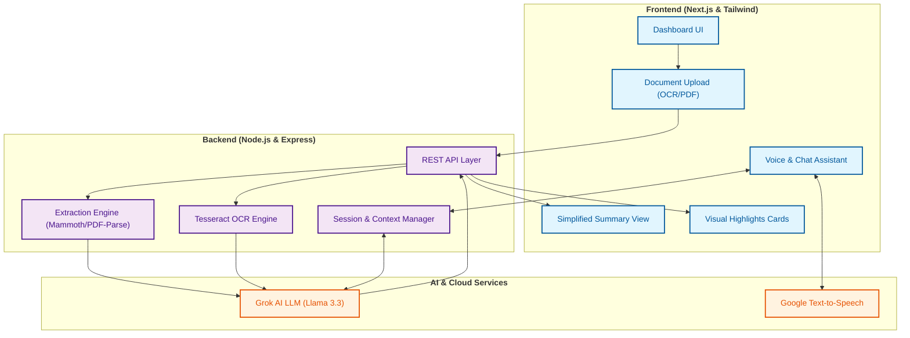

# Agreeva
### Understand Before You Agree

## Architecture Diagram

## Overview
Agreeva is an AI-powered platform designed to ensure that everyone, regardless of their background or literacy level, truly understands what they are signing.
- **Simplifies complex documents**: Translates dense legal jargon into clear, everyday language.
- **Interactive Support**: Provides a context-aware chatbot for real-time query resolution.
- **Multilingual & Accessible**: Supports multiple languages and includes voice assistance for those who prefer listening over reading.
- **Informed Consent**: Features a verification process to ensure users grasp key terms before giving their final authorization.

## Problem Statement
In today's fast-paced world, financial documents are becoming increasingly complex. Most users are presented with long, jargon-heavy agreements that they often sign without fully understanding the underlying terms, risks, or commitments. This lack of comprehension leads to informed consent being more of a formality than a reality.

## Solution
Agreeva bridges the gap between complex legalities and user understanding through:
- **Simplification**: Breaking down long documents into a few essential points.
- **Visual Breakdown**: Summarizing key numbers like loan amounts, EMIs, and interest rates into easy-to-read cards.
- **Chatbot Assistance**: Allowing users to ask questions about specific clauses and get immediate, simple answers.
- **Voice Support**: Narrating the simplified summary so users can listen and understand more deeply.
- **Consent Verification**: A quick check-in process to confirm the user understands the key highlights before signing.

## Features
- **AI-Based Document Simplification**: Advanced AI that extracts the most important points from any financial agreement.
- **Visual Financial Data**: Clear, bold representation of loan amounts, interest, and duration.
- **Context-Aware Chatbot**: A dedicated assistant that knows the specifics of your current document.
- **Multilingual Support**: Switch between English, Hindi, and Marathi for a more native experience.
- **Voice Help (Text-to-Speech)**: Integrated audio playback for simplified summaries.
- **Easy Upload**: Support for PDF, Word documents, and camera-captured images (OCR).
- **Verified Consent**: Timestamped consent flow that includes an "Understanding Check".

## How It Works
1. **Upload**: Upload your document or capture a clear photo of the agreement.
2. **Analyze**: Agreeva's AI extracts the text and simplifies the complex clauses.
3. **Review**: Read the simplified summary and view the visual breakdown of key financial figures.
4. **Interact**: Use the chatbot to ask questions like "What happens if I miss an EMI?"
5. **Listen**: Use the voice assistant to hear the summary explained in your preferred language.
6. **Verify & Agree**: Pass a quick understanding check and provide your informed consent.

## Why Agreeva?
- **User-Centric**: Designed with a focus on simplicity and ease of use.
- **Highly Accessible**: Built to be inclusive for users with low financial or digital literacy.
- **Understanding First**: We shift the focus from just "signing" to actually "comprehending" the commitment.

## Future Scope
- **Direct Bank Integrations**: Connecting directly to financial institutions for seamless document flow.
- **Advanced RAG System**: Enhancing the chatbot with broader financial knowledge bases for more expert advice.
- **Mobile App Expansion**: Native iOS and Android apps for better camera usage and offline support.
- **Cloud Scaling**: Infrastructure improvements to handle larger documents and higher traffic.

---

### Conclusion
**Agreeva ensures users truly understand before they agree.**
