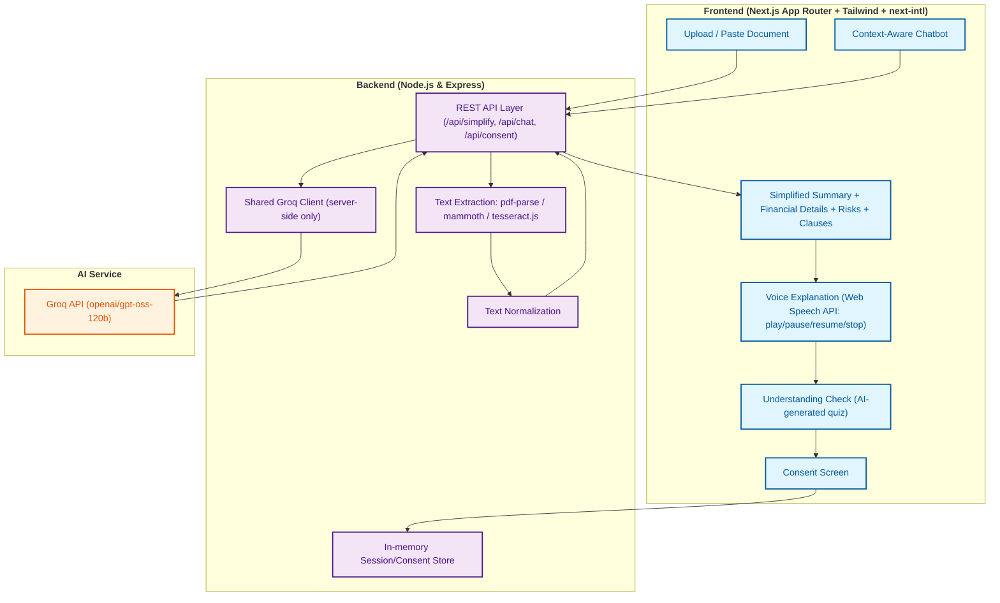

# Agreeva
### Understand Before You Agree

## Architecture Diagram



## Overview
Agreeva is an AI-powered platform designed to help people, regardless of literacy level, truly understand what they are signing before they agree to a financial document.

- **Simplifies complex documents**: turns dense legal/financial language into plain, everyday sentences.
- **Interactive support**: a chatbot that answers questions grounded in the uploaded document (never invents information).
- **Multilingual & accessible**: English, Hindi and Marathi throughout the flow, plus voice narration.
- **Verified understanding, not just a click**: an AI-generated comprehension check and an explicit consent record before "agreeing".

## How It Works (current implementation)

```
Upload PDF / DOCX / Image, or paste text
        v
Text extraction (pdf-parse / mammoth / tesseract.js) + normalization
        v
AI analysis via Groq (simplified summary, financial details, risks,
important clauses, and a grounded understanding-check quiz)
        v
Review the analysis, switch language (English/Hindi/Marathi)
        v
Listen to the summary (Web Speech API - play / pause / resume / stop)
        v
Ask the context-aware chatbot questions about the document
        v
Take the AI-generated Understanding Check
        v
Review your score, then give an explicit, recorded consent confirmation
```

## Features

### Implemented
- **Document upload & extraction**: PDF (`pdf-parse`), Word `.doc`/`.docx` (`mammoth`), images via OCR (`tesseract.js`, English/Hindi/Marathi), and pasted plain text. All extraction paths are passed through a shared normalizer so output never starts with stray blank lines/whitespace and paragraph structure is preserved.
- **AI-based document simplification**: Groq (`openai/gpt-oss-120b`, called only from the backend, with `reasoning_effort: "low"` to keep each call's hidden reasoning-token usage small - this model's rate limit on a typical key is a fairly tight 8,000 tokens/minute, and the default reasoning effort alone can burn most of that in 2-3 calls) returns a simple-language summary, financial details (loan amount, interest rate, tenure, EMI, total payable), a risk level with individual risk/warning items, and a short list of important clauses actually present in the document. The model is explicitly instructed never to invent or estimate figures that aren't in the document.
- **Visual breakdown**: EMI, total payment, and interest shown as animated cards and a principal-vs-interest chart, only when the corresponding figures were actually found in the document.
- **Context-aware chatbot**: answers questions using the uploaded document text (or a relevance-ranked excerpt + the AI analysis for large documents), keeps conversation history for follow-up questions, responds in the selected language, and clearly says so when an answer isn't in the document instead of guessing.
- **Voice explanation (Text-to-Speech)**: browser Web Speech API with play, pause, resume and stop controls, in English, Hindi, and Marathi (Marathi falls back to a Hindi voice when the browser has no Marathi voice installed - most browsers still don't ship one).
- **Understanding Check**: 3-5 quiz questions generated by the same AI analysis call, grounded strictly in facts present in the document; if the document doesn't contain enough concrete facts, the check is skipped gracefully instead of showing made-up questions.
- **Risk alerts**: an animated risk meter and per-risk cards (with voice playback) before the user proceeds to consent.
- **Consent flow**: three explicit, unchecked-by-default confirmation checkboxes, a required understanding-check pass/fail summary, and a clearly stated disclaimer that this is an **application-level acknowledgement**, not a legally verified digital signature or consent under any e-signature law. The confirmation is recorded with the document name, a timestamp, the quiz score, and the consent checkboxes.
- **Multilingual UI**: English, Hindi, and Marathi across the upload flow, analysis, chatbot, understanding check, consent screen, and error messages, via `next-intl` routing and a shared translations table.
- **Loading & error handling**: every AI-backed action (extraction, analysis, chatbot, consent submission) has a loading state, guards against duplicate submissions, and shows a user-friendly error instead of failing silently or fabricating data on failure.

### Not currently wired up
- `backend/routes/tts.js` (server-side Google TTS via `google-tts-api`) exists but is not called by the frontend - all voice playback is done client-side with the Web Speech API. Kept for potential future use as a fallback for browsers without speech synthesis.
- `frontend/components/document-comparison.tsx` (multi-offer loan comparison with sample data) is not currently rendered in the main flow.
- The optional "voice confirmation" recording in the consent screen is a UI simulation, not real speech verification.

## Project Structure

```
Agreeva/
  backend/
    routes/        # simplify, chat, consent, upload, tts
    services/      # shared Groq client, system prompts, in-memory stores
    utils/         # text normalization
    server.js
    .env.example
  frontend/
    app/[locale]/  # Next.js App Router pages (next-intl locales: en, hi, mr)
    components/    # upload, analysis, voice, quiz, consent, chatbot, UI kit
    lib/           # types, translations
    hooks/         # useTTS (Web Speech API)
```

## Setup

### Requirements
- Node.js 18+
- A [Groq API key](https://console.groq.com/keys)

### Backend

```bash
cd backend
npm install
cp .env.example .env   # then fill in your GROQ_API_KEY
node server.js          # or: npm start
```

Runs on `http://localhost:5000` by default.

### Frontend

```bash
cd frontend
npm install
cp .env.example .env.local   # points the frontend at the backend above
npm run dev
```

Runs on `http://localhost:3000` by default (or the next free port).

### Environment Variables

| Variable | Where | Purpose |
|---|---|---|
| `GROQ_API_KEY` | `backend/.env` | Server-side Groq API key. **Never** exposed to the browser - only backend code reads `process.env.GROQ_API_KEY`. |
| `PORT` | `backend/.env` | Backend port (default `5000`). |
| `NEXT_PUBLIC_API_URL` | `backend/.env` and/or `frontend` env | Base URL the frontend uses to reach the backend (default `http://localhost:5000`). |

`.env` files are git-ignored; only `backend/.env.example` (placeholder values) is committed.

## Supported File Types
PDF (`.pdf`), Word (`.doc`, `.docx`), images (`.png`, `.jpg`, `.jpeg`, etc. via OCR), plain text (`.txt`), and directly pasted text. Uploads are capped at 5MB and validated by file type before processing.

## Security Notes
- The Groq API key is read only in backend code and is never included in any API response.
- Uploaded/pasted document content is treated as untrusted data: the AI prompts explicitly instruct the model not to follow instructions embedded in a document, and the chatbot always treats document text as reference material rather than commands.
- File uploads are restricted by MIME type/extension to the formats the extraction pipeline actually supports.
- `backend/.env` (and `node_modules`, `.next`, etc.) are excluded from version control via `.gitignore`.

## Why Agreeva?
- **User-centric**: designed for simplicity and ease of use.
- **Highly accessible**: built for users with low financial or digital literacy, in their own language.
- **Understanding first**: the flow shifts the focus from "signing" to actually "comprehending" the commitment, with a real (if application-level, not legal) checkpoint before consent.

## Future Scope
- Real digital-signature-grade consent (e-signature integration) rather than an application-level acknowledgement.
- Direct bank/lender integrations for seamless document intake.
- A broader RAG-based knowledge base for general financial guidance beyond the uploaded document.
- Native mobile apps for camera capture and offline support.

---

### Conclusion
**Agreeva ensures users truly understand before they agree.**
